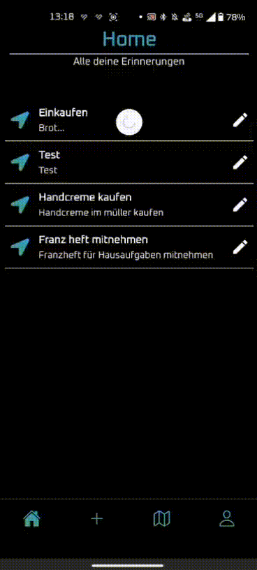
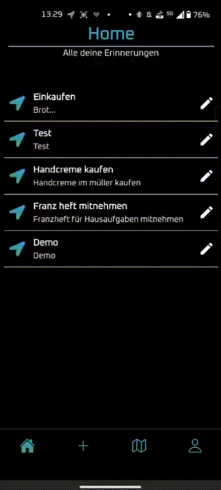
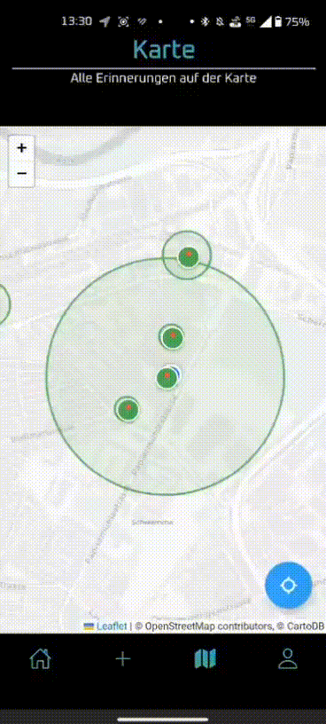
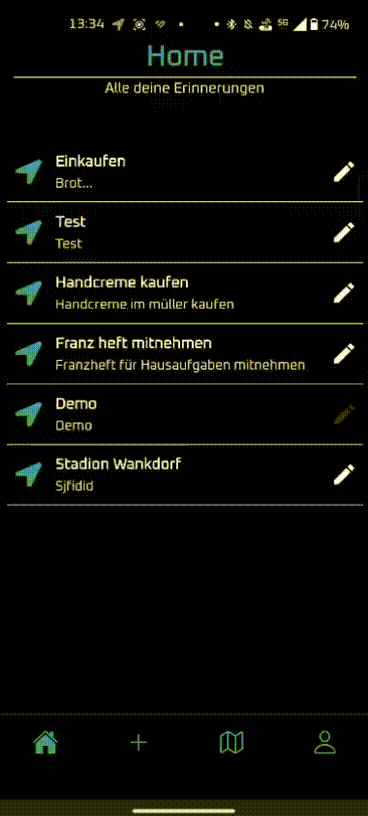
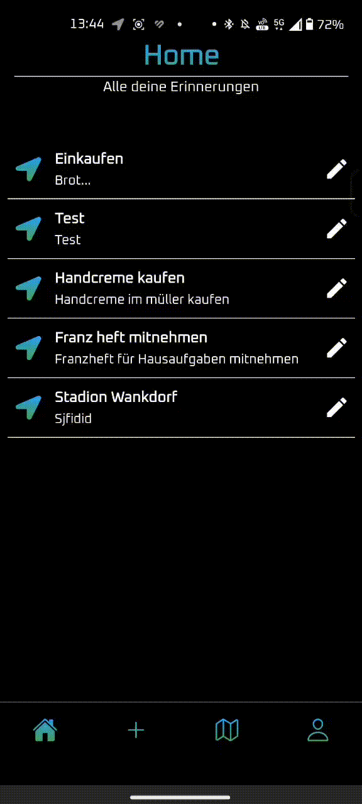
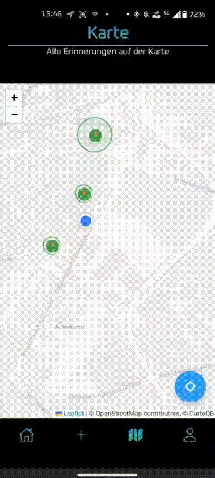
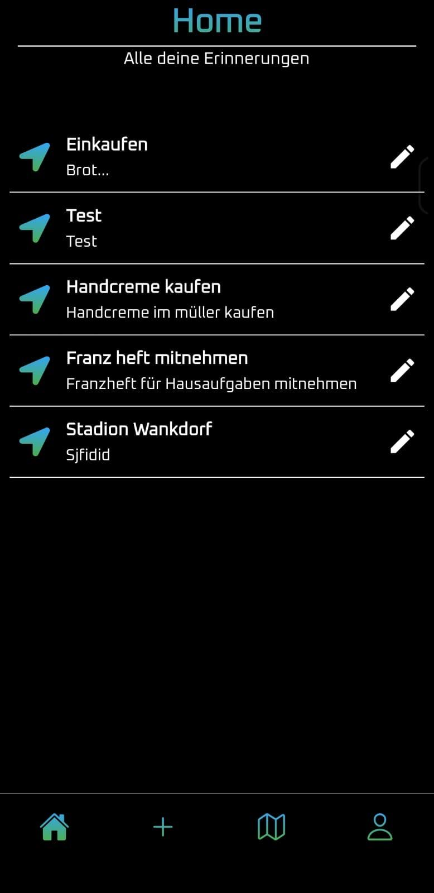

# 📌 GeoReminder  
> Location-based reminders that notify you when it matters, where it matters.



---

## Key Features

### Create Geo-Reminders  
- Select any place on the map  
- Define a radius (e.g., 500 meters)  
- Add a title and description  
- Save it locally or sync with your account  



---

### 🗺️ View All Reminders on a Map  
- Visualize all created reminders as pins  
- Zoom and pan across the map  
- Click pins to view reminder info  



---

### 📝 Edit or Delete Reminders  
- Tap edit icon to change title, radius, or position  
- Easily remove outdated reminders  



---

### 🔔 Location-Based Notifications  
- Triggers a reminder when entering the defined area  
- Works seamlessly in the background  


---

### 📶 Offline First, Online Sync  
- Fully usable offline with local storage  
- Log in to sync reminders with backend  
- Conflict-resilient two-way sync  



---

## 🎨 UI & Interaction Highlights

- Smooth transitions and animations  
- Intuitive tab navigation  
- Tailwind-powered styling (Nativewind)



---

## 🖼️ Homepage Screenshot



---

## 🎯 Project Context

📘 **GeoReminder** was developed as part of a **3-day school project** by a team of three developers:  
- Aaron Mettler  
- Jonas Schären  
- Loris Stahlberg  

The app solves a common problem: time-based reminders often trigger at the wrong moment because you don’t know exactly when you’ll be somewhere. GeoReminder ties reminders to locations, so you’re reminded exactly when you arrive at the right place.

---

## 🧰 Tech Stack

**Frontend:**  
- React Native  
- Expo  
- Nativewind (Tailwind CSS for RN)  
- AsyncStorage  

**Backend:**  
- Node.js  
- Express  
- PostgreSQL (NeonDB)  
- JWT Authentication  

---

## 📂 Data Flow  

For a detailed overview of how local storage, backend sync, and IDs are managed, see [DATAFLOW_SUMMARY.md](DATAFLOW_SUMMARY.md).  

---

## 🚀 Getting Started

### Prerequisites  
- Node.js (LTS)  
- Expo CLI (`npm install -g expo-cli`)  
- PostgreSQL (NeonDB or local setup)

---

### Setup Instructions

```bash
# Clone both frontend and backend
git clone https://github.com/YourUser/GeoReminder
cd GeoReminder

# Install frontend dependencies
npm install

# Navigate to backend and install
cd ../GeoReminderBackend
npm install

# Add environment variables
cp .env.example .env
# → Fill in DB_URL, JWT_SECRET, etc.

# Start the backend
node server.js

# Start the frontend
cd ../GeoReminder
npx expo start
```
---

## 🧪 How It Works (Behind the Scenes)

- The user sets a location and radius → stored as coordinates  
- Geofencing logic compares current GPS to saved zones  
- When entering a zone, a notification is triggered  
- Reminders are stored locally via AsyncStorage  
- Optional login syncs reminders via REST API to PostgreSQL  
- Sync logic is bidirectional and conflict-resilient  

---

<!-- ## 📜 License  

This project is licensed under the **MIT License** – see the [LICENSE](LICENSE) file for details.  

--- -->

## ✍️ Note  

README made by **Loris Stahlberg**  
